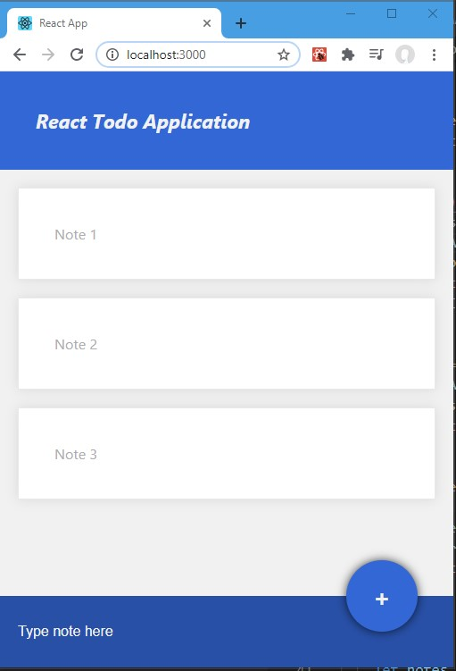

# Create simple Inmemory Todo List in React

### Quick start

1. Clone this repo using `git clone https://github.com/VJ-Jain/React-ToDo.git`
2. Change working directory: `cd React-ToDo`.
3. Run `npm install` to install dependencies.
4. Run `npm start` to see the example app at `http://localhost:3000`.

### How it works

1. Type new note, click + to add the note.
2. Click on the note to delete it.

---

This project was bootstrapped with [Create React App](https://github.com/facebook/create-react-app).

